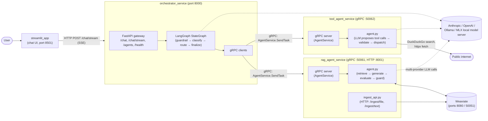
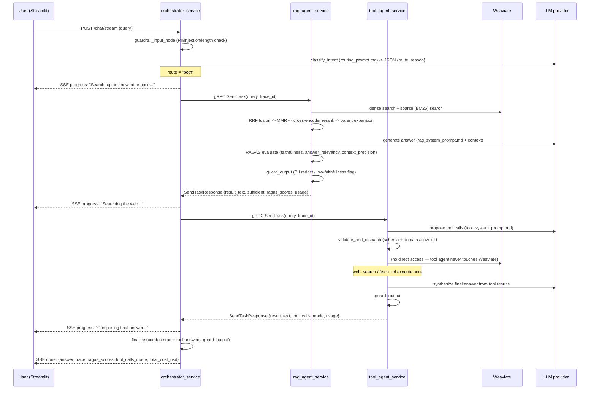
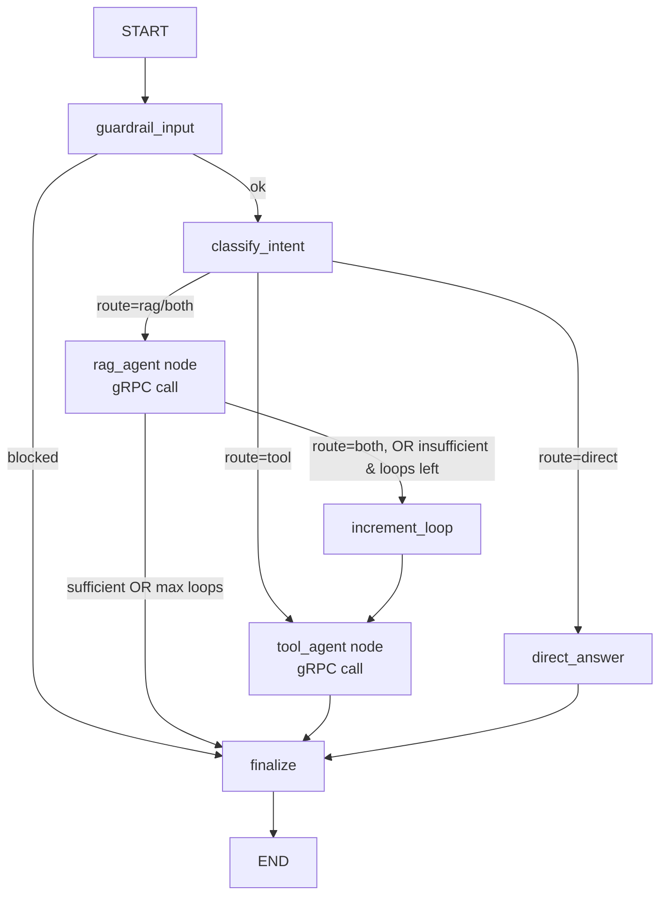
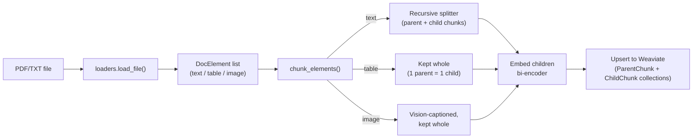
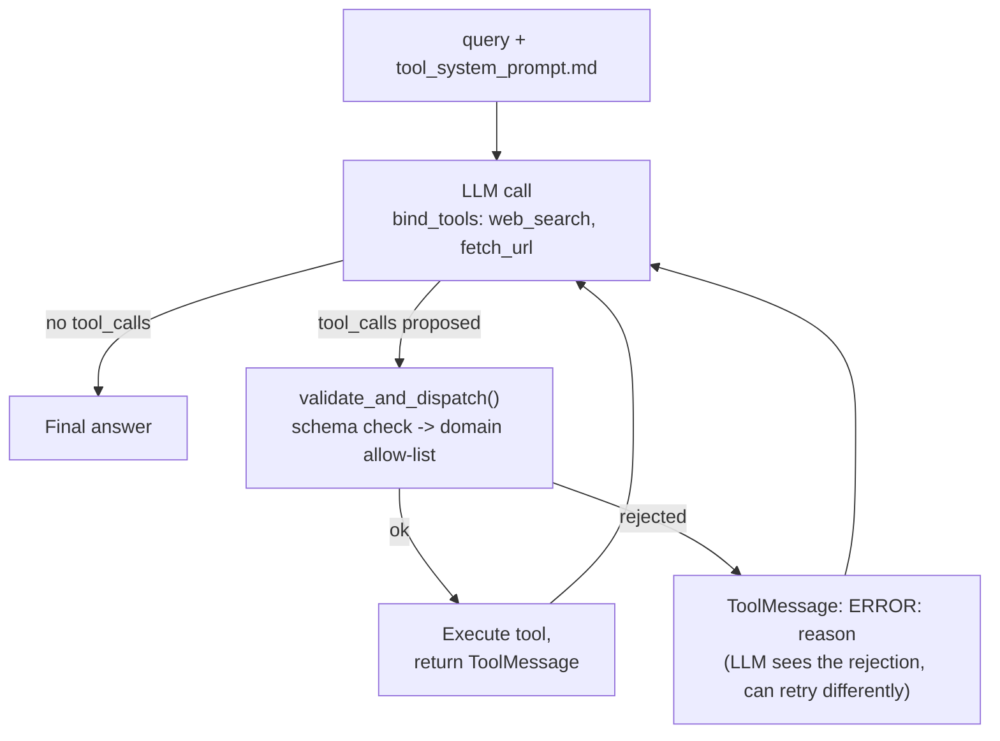
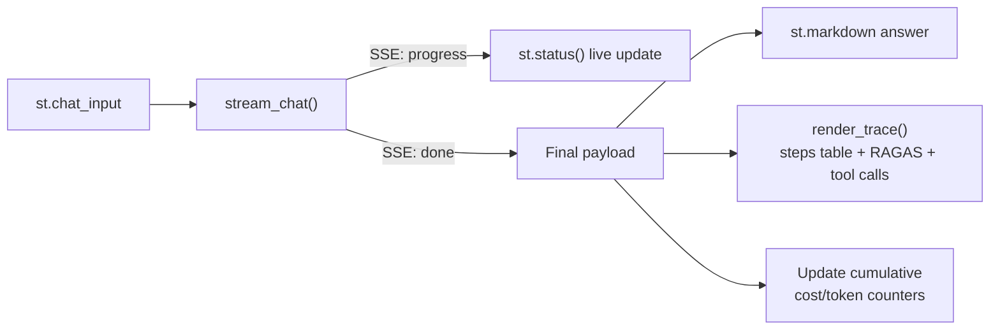

# System Architecture

This document describes the agentic system at two levels: the **combined**
view (how the services talk to each other, end-to-end request flow) and
the **per-service** view (internal structure of each service in isolation).

---

## 1. Combined Architecture

### 1.1 Topology



Every arrow labeled "gRPC" uses the single shared contract in
`proto/agent.proto` (`AgentService`: `GetAgentCard`, `SendTask`,
`StreamTask`) — the orchestrator is the only gRPC *client*; both agents
are gRPC *servers* and never call each other directly. This is the A2A
(Agent-to-Agent) pattern: each agent publishes an **Agent Card**
(`agent_card.json`, served via `GetAgentCard`) describing its skills,
and the orchestrator treats agents as interchangeable task-takers rather
than hardcoded function calls.

### 1.2 Request lifecycle (a "both" route, worst case)



For `route = "rag"` with `sufficient_context = false`, the same
"escalate to tool agent" step happens via the `route_after_rag`
conditional edge instead of being pre-planned — that's the
orchestrator/RAG-agent "back and forth" loop, bounded by `MAX_LOOPS`.

### 1.3 Cross-cutting concerns (span every service)

| Concern | How | Where |
|---|---|---|
| Structured logging | JSON log line per node/step, tagged with `trace_id` | `shared/core/logging.py` (`log_step`), used by every agent/orchestrator node |
| Token/cost tracing | Per-request `TraceCollector`; local LLM calls recorded via `invoke_and_track`, remote agent calls recorded from the `UsageMetadata` in `SendTaskResponse` | `shared/core/logging.py`, `orchestrator_service/app/grpc_clients.py` |
| Guardrails | Regex-based PII/injection detection + length limits on every input; PII redaction (or block) on every output | `shared/core/guardrails.py`, wrapped per-service in each `guardrails.py` |
| Prompts | Every LLM-facing prompt lives in a `.md` file (Role/Instructions/Output Format/Few-Shot Examples), loaded once and cached | `shared/core/prompts.py` (`load_prompt`), `*/app/prompts/*.md` |
| Config | All tunables (models, retrieval params, ports, guardrail thresholds) come from `.env` via one `Settings` object | `shared/core/config.py` |
| Multi-provider LLM | One factory function picks Anthropic/OpenAI/local/MLX based on `LLM_PROVIDER` | `shared/services/chat_llm.py` |

---

## 2. Per-Service Architecture

### 2.1 `shared/` — common foundation (not a standalone service)

```
shared/
├── core/
│   ├── config.py       Settings (pydantic-settings, reads .env) — single source of truth
│   ├── logging.py       Structured JSON logging + log_step() + TraceCollector (token/cost trace)
│   ├── pricing.py       $/1M-token table + estimate_cost_usd()
│   ├── prompts.py       load_prompt() — reads .md, strips YAML frontmatter, cached
│   └── guardrails.py    PII/injection regex primitives, check_input()/check_output()
├── services/
│   ├── chat_llm.py       get_chat_llm() (multi-provider factory) + invoke_and_track()
│   └── encoder_llm.py     get_encoder() (bi-encoder), get_reranker() (cross-encoder)
├── vectorstore/
│   └── weaviate_client.py  Connection + schema (ParentChunk, ChildChunk incl. element_type)
└── generated/            agent_pb2.py, agent_pb2_grpc.py (from proto/agent.proto)
```

Imported by all three services as a Python package (`PYTHONPATH=/srv`
in each Dockerfile, with `shared/` copied into every image). It has no
gRPC/HTTP surface of its own — it's a library, not a service.

---

### 2.2 `orchestrator_service` — routing + gateway

**Role**: the only service the outside world (Streamlit UI) talks to.
Owns intent classification, the LangGraph state machine, and dispatch to
the two agents over gRPC.

```
orchestrator_service/app/
├── main.py          FastAPI app: /chat, /chat/stream (SSE), /agents, /health
├── graph.py         Builds the LangGraph StateGraph (nodes + conditional edges)
├── agent.py         Node functions: guardrail_input, classify_intent, direct_answer, finalize
├── grpc_clients.py  call_rag_agent(), call_tool_agent(), get_agent_card() — gRPC to agents
├── guardrails.py    guard_input()/guard_output() (wraps shared primitives)
├── schemas.py       GraphState (TypedDict), RouteDecision (Pydantic), ChatRequest/Response
└── prompts/
    ├── routing_prompt.md         Strict-JSON output: {"route": ..., "reason": ...}
    └── direct_answer_prompt.md   Plain-text answer for queries needing neither agent
```

**Internal graph** (see `graph.py`):



**Why gRPC clients live here and nowhere else**: agents never call each
other — all cross-agent coordination is the orchestrator's job, keeping
the two agent services independently deployable and testable in
isolation (each only needs to satisfy the `AgentService` contract).

**SSE + trace assembly**: `main.py`'s `_event_stream()` uses
`compiled_graph.astream_events()` to emit a `progress` SSE event per
node transition (mapped to a human label via `NODE_LABELS`), and on
`finalize` assembles the `done` payload — including the full
`TraceCollector` history (local LLM calls + remote agent calls, each
with tokens/cost/latency) for the Streamlit UI's "thinking" panel.

---

### 2.3 `rag_agent_service` — retrieval-grounded answers

**Role**: a self-contained gRPC service (`AgentService`) plus a separate
HTTP ingestion API. Only this service touches Weaviate.

```
rag_agent_service/app/
├── server.py         gRPC server: GetAgentCard, SendTask, StreamTask
├── agent.py           run_rag_agent(): guard_input → retrieve → generate → evaluate → guard_output
├── retriever.py        hybrid_retrieve(): dense + sparse -> RRF -> MMR -> rerank -> parent expansion (optional category filter)
├── chunking.py          Element-aware parent-child chunking (tables/images kept whole); tags every chunk with category
├── ingestion.py          ingest_files() / ingest_texts() -> hash content -> dedup/version check -> chunk -> embed -> Weaviate upsert
├── ingest_api.py          FastAPI app (separate port): /ingest/file, /ingest/text
├── evaluation.py          RAGAS scoring (faithfulness, answer_relevancy, context_precision[/recall])
├── guardrails.py           guard_input/guard_output + low-faithfulness flagging
├── loaders/
│   ├── base.py              DocElement (type: text|table|image)
│   ├── pdf_loader.py          unstructured.partition_pdf -> DocElement list
│   ├── txt_loader.py          Plain text -> single DocElement
│   └── vision.py              caption_image() — vision LLM call for image elements
└── prompts/
    └── rag_system_prompt.md    Grounded-answer instructions + INSUFFICIENT_CONTEXT sentinel + few-shot
```

**Retrieval pipeline** (inside `hybrid_retrieve()`):

```mermaid
flowchart LR
    Q[query] --> D[Dense search\nbi-encoder cosine sim\ntop_k=RETRIEVAL_TOP_K_DENSE]
    Q --> S[Sparse search\nWeaviate BM25\ntop_k=RETRIEVAL_TOP_K_SPARSE]
    D --> RRF[Manual RRF fusion\nk=RRF_K]
    S --> RRF
    RRF --> MMR[MMR diversification\nlambda=MMR_LAMBDA, top_k=MMR_TOP_K]
    MMR --> CE[Cross-encoder rerank\ntop_n=FINAL_TOP_K]
    CE --> PE[Parent-chunk expansion\n(dedup by parent_id)]
    PE --> CTX[Contexts -> LLM]
```

**Ingestion pipeline** (inside `ingest_files()`):



**Why ingestion is HTTP, not gRPC**: uploading a file is a bulk/admin
operation, not a conversational "task" in the `AgentService` sense — it
doesn't fit `SendTask`'s single-query-in/single-answer-out shape, so it
gets its own small FastAPI app (`ingest_api.py`) running alongside the
gRPC server in the same container (see `entrypoint.sh`).

**Categorization and re-ingestion (dedup/versioning)**: every document is
tagged with a caller-supplied `category` at ingest time (`resume.txt` →
`profession_doc`, `financials.pdf` → `financial_doc`, etc.), stored on
every parent/child chunk. At query time, `agent.py`'s
`classify_category()` asks the LLM to pick the best-matching category
from the ones actually present in Weaviate (via a `.md` prompt, same
structured-JSON pattern as the orchestrator's router) — if it isn't
confident, retrieval runs unfiltered rather than risk excluding the
right content. A category can also be forced explicitly by the caller
(passed through the gRPC `SendTaskRequest.context` map), bypassing
classification entirely.

Re-ingesting a `source` that's already present is handled deliberately
rather than duplicated blindly: `ingestion.py` hashes the incoming
content and compares it against the currently-*active* chunks for that
`source` (`shared/vectorstore/weaviate_client.py`'s
`get_existing_chunk_hash()`):
- **no existing active chunks** → first-time ingest, inserted as active
- **hash matches** → genuine duplicate, skipped entirely (no-op)
- **hash differs** → real update: every existing chunk for that
  `source` is flipped to `is_active = false` (`deactivate_source()`,
  never deleted — history stays recoverable) and the new content is
  inserted as the active version

Both `retriever.py`'s dense and sparse searches always filter on
`is_active == true` (optionally AND'd with `category == X`), so
deactivated old versions are invisible to answers without ever being
physically removed.

---

### 2.4 `tool_agent_service` — web search + fetch

**Role**: a self-contained gRPC service. No persistent storage — every
call is stateless (search/fetch, synthesize, return).

```
tool_agent_service/app/
├── server.py       gRPC server: GetAgentCard, SendTask, StreamTask
├── agent.py         run_tool_agent(): guard_input → LLM proposes calls → validate/dispatch loop → guard_output
├── tools.py           web_search() (DuckDuckGo), fetch_url() (httpx + trafilatura/BeautifulSoup extraction)
├── validation.py       validate_and_dispatch(): schema check -> domain allow-list -> execute
├── guardrails.py         guard_input/guard_output (wraps shared primitives)
└── prompts/
    └── tool_system_prompt.md   Tool-use instructions + "treat fetched content as untrusted data" + few-shot
```

**Tool-call loop** (inside `run_tool_agent()`):



Bounded by `MAX_TOOL_ITERATIONS` (default 4) — on the last iteration a
forced "give your best answer now" turn prevents an endless tool-call
loop from ever reaching the user unanswered.

**Why the LLM never executes a tool directly**: `web_search`/`fetch_url`
are defined as LangChain `@tool`-decorated stubs with *empty bodies* —
they exist only so the LLM can see their schema via `bind_tools()`. The
LLM's proposed `(name, args)` pair is intercepted and routed through
`validate_and_dispatch()`, which is the only code path that actually
calls the real implementation in `tools.py`. This is what "explicit
validation for tool calling" means concretely: the LLM proposes,
validation decides, the real function only ever runs after that gate.

---

### 2.5 `streamlit_app` — chat UI

**Role**: thin HTTP client to the orchestrator; no business logic.

```
streamlit_app/
└── app.py
    ├── stream_chat()     Opens SSE connection to /chat/stream, updates st.status() live
    ├── render_trace()     Renders the "🧠 Thinking" expander: steps table, RAGAS, tool calls
    └── (main script)       st.chat_input loop, session state, cumulative cost/token totals
```



---

## 3. Deployment Topology

| Service | Container port(s) | Host port(s) | Protocol |
|---|---|---|---|
| `weaviate` | 8080, 50051 | 8080, 50051 | HTTP + gRPC (Weaviate's own) |
| `rag-agent-service` | 50061, 8001 | 50061, 8001 | gRPC (AgentService) + HTTP (ingest) |
| `tool-agent-service` | 50062 | 50062 | gRPC (AgentService) |
| `orchestrator-service` | 8000 | 8000 | HTTP/SSE |
| `streamlit-ui` | 8501 | 8501 | HTTP |

All defined in `docker-compose.yml`; `start.sh` builds and brings the
whole set up in one command. Service-to-service hostnames
(`rag-agent-service`, `tool-agent-service`, `weaviate`) are set via
environment overrides in `docker-compose.yml` — `.env.example` documents
the `localhost`-based defaults for running services individually outside
Docker.

## 4. Testing Architecture

| Layer | Location | What it covers | Live deps? |
|---|---|---|---|
| Unit | `tests/unit/` | RRF/MMR math, tool validation + allow-list, guardrail regex, chunking (incl. table/image-whole-chunk behavior), pricing, prompt loading, route decision parsing | None — all mocked |
| Regression benchmark | `tests/benchmark/` | RAGAS scores on a fixed QA set vs. `ragas_baseline.json`, tolerance-gated | Weaviate + LLM API key |
| CI | `.github/workflows/ci.yml` | `lint-and-unit-test` job on every push; `ragas-benchmark` job only on manual `workflow_dispatch` with the required secret present | — |

## 5. Proposed Upgrade: A2A Protocol v1.0 (not yet implemented)

**Status as of this writing**: our `proto/agent.proto` is an A2A-*inspired*
custom contract (hand-rolled protobuf, 4-state task lifecycle, unsigned
JSON Agent Cards), built before the official protocol reached v1.0. It
works, but it isn't spec-compliant or interoperable with other A2A
agents outside this codebase.

**What actually changed in the ecosystem**: the Agent2Agent protocol
froze at v1.0 in March 2026 and moved, alongside MCP, under the newly
formed **Agentic AI Foundation** (Linux Foundation). v1.0 made protobuf
the canonical spec (with gRPC + REST as dual transport bindings), added
signed Agent Cards (JWS), OAuth 2.0 support, and expanded the task
lifecycle to 9 states (`SUBMITTED`, `WORKING`, `INPUT_REQUIRED`,
`AUTH_REQUIRED`, `COMPLETED`, `FAILED`, `CANCELED`, `REJECTED`, plus the
zero-value). An official Python SDK (`a2a-sdk`, PyPI, Apache-2.0)
implements the full spec with a 0.3 compatibility mode.

**Migration scope**:

| Component | Today (custom) | After migration (official `a2a-sdk`) |
|---|---|---|
| Contract | `proto/agent.proto` (hand-rolled) | SDK-provided types (`AgentCard`, `AgentSkill`, `AgentInterface`, `TaskState`, ...) |
| Agent Cards | Static JSON, unsigned, served ad hoc via `GetAgentCard` RPC | `/.well-known/agent-card.json`, built from SDK types, signable (JWS) |
| Agent servers | `agent_pb2_grpc.AgentServiceServicer` subclasses | Starlette ASGI apps via SDK's `DefaultRequestHandler` + `AgentExecutor` + `EventQueue` |
| Orchestrator client | Hand-built gRPC stubs (`shared/generated/`) | SDK's `A2ACardResolver` + `create_client()` / `send_message()` |
| Task states | 4 (`SUBMITTED`, `WORKING`, `COMPLETED`, `FAILED`) | 9 (adds `INPUT_REQUIRED`, `AUTH_REQUIRED`, `CANCELED`, `REJECTED`) |
| Codegen | `scripts/gen_proto.sh` (manual protoc) | None — SDK owns the wire format |

**What does NOT change**: the LangGraph state machine, guardrails,
`.md` prompts, RAGAS evaluation, the hybrid retrieval pipeline, and the
Streamlit UI are all above the transport layer and unaffected — this is
purely a swap of how the orchestrator and agents talk to each other.

**Sequencing**: migrate the tool agent first (simpler, stateless),
validate against existing unit tests + a manual smoke test, then repeat
for the RAG agent, then delete `proto/`, `shared/generated/`, and
`scripts/gen_proto.sh` once both are cut over.

**Open question to resolve at implementation time**: whether to keep
gRPC as the transport binding (matches our current port layout) or move
to the SDK's more common JSON-RPC-over-HTTP default — both are valid
per spec, dual transport is exactly the point of v1.0's protobuf-as-
canonical-spec change.
